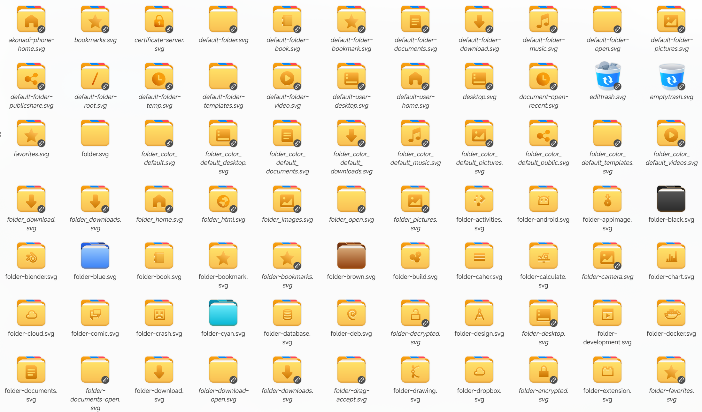

# DeepinYouth Icon Theme

A colorful icon theme for Linux desktops, inspired by the **Youth** icon theme and built on top of **Reversal** icon theme.

## Preview



## Features

- **~19,700 icons** covering a wide range of applications, actions, and system elements
- **Multiple sizes**: 16×16, 22×22, 24×24, 32×32, scalable, and symbolic
- **HiDPI ready**: All icons have @2x variants for high-resolution displays
- **Categories included**:
  - Actions (9,127)
  - Applications (1,499)
  - Categories (104)
  - Devices (690)
  - Emblems (164)
  - Emotes (39)
  - MIME Types (2,891)
  - Places (1,047)
  - Preferences (453)
  - Status (3,651)
  - Animations (103)
- **KDE Plasma** and **GNOME** compatible
- **Follows system color scheme**: symbolic icons adapt to light/dark mode

## Installation

### Manual installation

```bash
# Clone the repository
git clone https://github.com/SkyShadowHero/DeepinYouth-icons.git

# Install to user directory
cp -r DeepinYouth-icons ~/.local/share/icons/DeepinYouth

# Or install system-wide
sudo cp -r DeepinYouth-icons /usr/share/icons/DeepinYouth
```

Then select **DeepinYouth** in your system settings.

## Credits & Attribution

This icon theme is built upon the work of others. Special thanks to:

| Project | Author | License | Link |
|---------|--------|---------|------|
| Reversal | yeyushengfan258 | GPL-3.0 | [GitHub](https://github.com/yeyushengfan258/Reversal-icon-theme) |

## License

DeepinYouth icon theme is licensed under the **GNU General Public License v3.0** (GPL-3.0).
See [COPYING](COPYING) for the full license text.

The upstream Reversal icon theme is also GPL-3.0 licensed.

---

Made with ❤️ by SkyShadowHero
